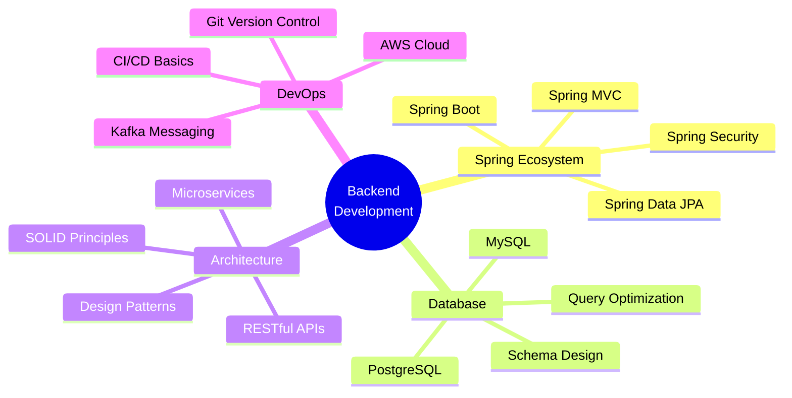

<div align="center">


</div>

<div align="center">

### 🚀 Building Scalable Backend Systems | 💻 Spring Boot Expert | ☁️ Cloud Native Developer

<br>


<br>

[](https://arpanc.netlify.app)
[](mailto:chakrabortyarpan151@gmail.com)
[](https://www.linkedin.com/in/arpan-chakraborty-63251227b/)


</div>

---


### 👨‍💻 &nbsp;About Me

```yaml
name: Arpan Chakraborty
role: Java Backend Developer
location: Kolkata, West Bengal, India 🇮🇳
education: B.Tech in Computer Science Engineering

current_work:
  - Enterprise Spring Boot Applications
  - RESTful API Development
  - Microservices Architecture
  - Database Design & Optimization

tech_stack:
  primary: [Java, Spring Boot, Hibernate]
  databases: [MySQL, PostgreSQL]
  cloud: [AWS, Apache Kafka]
  tools: [Git, Maven, Postman, IntelliJ IDEA]
  
mindset: |
  "Code is poetry written in logic.
   Every function tells a story,
   Every class builds a world."
   
fun_fact: "I turn coffee into code and bugs into features! ☕→💻"
```

<br>

### 🎯 &nbsp;Core Focus Areas

```typescript
const expertise = {
    backend: {
        frameworks: ['Spring Boot', 'Spring MVC', 'Spring Security'],
        orm: ['Hibernate', 'Spring Data JPA'],
        api: ['REST', 'JSON', 'XML']
    },
    database: {
        relational: ['MySQL', 'PostgreSQL'],
        skills: ['Query Optimization', 'Schema Design', 'Indexing']
    },
    architecture: {
        patterns: ['MVC', 'Microservices', 'Layered Architecture'],
        principles: ['SOLID', 'DRY', 'Clean Code']
    },
    devops: {
        cloud: ['AWS EC2', 'AWS S3', 'AWS RDS'],
        messaging: ['Apache Kafka'],
        vcs: ['Git', 'GitHub']
    }
};
```

<br clear="right"/>

---

<h2 align="center">🛠️ Technology Arsenal</h2>

<div align="center">

<table>
<tr>
<td align="center" width="25%">

<br><strong>Java</strong>
<br><sub>Core Language</sub>
</td>
<td align="center" width="25%">

<br><strong>Spring Boot</strong>
<br><sub>Framework</sub>
</td>
<td align="center" width="25%">

<br><strong>MySQL</strong>
<br><sub>Database</sub>
</td>
<td align="center" width="25%">

<br><strong>PostgreSQL</strong>
<br><sub>Database</sub>
</td>
</tr>
<tr>
<td align="center" width="25%">

<br><strong>C</strong>
<br><sub>Programming</sub>
</td>
<td align="center" width="25%">

<br><strong>JavaScript</strong>
<br><sub>Scripting</sub>
</td>
<td align="center" width="25%">

<br><strong>Hibernate</strong>
<br><sub>ORM</sub>
</td>
<td align="center" width="25%">

<br><strong>Kafka</strong>
<br><sub>Messaging</sub>
</td>
</tr>
<tr>
<td align="center" width="25%">

<br><strong>AWS</strong>
<br><sub>Cloud</sub>
</td>
<td align="center" width="25%">

<br><strong>Git</strong>
<br><sub>Version Control</sub>
</td>
<td align="center" width="25%">

<br><strong>Postman</strong>
<br><sub>API Testing</sub>
</td>
<td align="center" width="25%">

<br><strong>Maven</strong>
<br><sub>Build Tool</sub>
</td>
</tr>
<tr>
<td align="center" width="25%">

<br><strong>HTML5</strong>
<br><sub>Markup</sub>
</td>
<td align="center" width="25%">

<br><strong>CSS3</strong>
<br><sub>Styling</sub>
</td>
<td align="center" width="25%">

<br><strong>IntelliJ IDEA</strong>
<br><sub>IDE</sub>
</td>
<td align="center" width="25%">

<br><strong>VS Code</strong>
<br><sub>Editor</sub>
</td>
</tr>
</table>

</div>

---

<h2 align="center">📊 GitHub Performance Dashboard</h2>

<div align="center">

<table width="100%">
<tr>
<td width="50%">


</td>
<td width="50%">


</td>
</tr>
<tr>
<td width="50%">


</td>
<td width="50%">


</td>
</tr>
</table>

</div>

<br>

<div align="center">


</div>

---

<h2 align="center">🏆 Achievements & Recognition</h2>

<div align="center">


</div>

<br>

<div align="center">

<table>
<tr>
<td align="center" width="20%">

<br><strong>200+</strong>
<br><sub>Contributions</sub>
</td>
<td align="center" width="20%">

<br><strong>Active</strong>
<br><sub>Developer</sub>
</td>
<td align="center" width="20%">

<br><strong>Clean</strong>
<br><sub>Code Advocate</sub>
</td>
<td align="center" width="20%">

<br><strong>Backend</strong>
<br><sub>Specialist</sub>
</td>
<td align="center" width="20%">

<br><strong>Open</strong>
<br><sub>Source</sub>
</td>
</tr>
</table>

</div>

---

<h2 align="center">🎯 What I'm Building</h2>

<div align="center">

<table>
<tr>
<td width="33%" align="center">

### 🏗️ Enterprise Systems
Building robust backend solutions with Spring Boot that handle thousands of requests per second

</td>
<td width="33%" align="center">

### 🔌 RESTful APIs
Crafting clean, well-documented APIs following industry best practices and standards

</td>
<td width="33%" align="center">

### 🗄️ Database Design
Optimizing queries and designing efficient schemas for high-performance applications

</td>
</tr>
<tr>
<td width="33%" align="center">

### ☁️ Cloud Solutions
Deploying scalable applications on AWS with modern DevOps practices

</td>
<td width="33%" align="center">

### 📚 Learning
Exploring microservices, Docker, Kubernetes, and distributed systems architecture

</td>
<td width="33%" align="center">

### 🤝 Collaborating
Contributing to open-source and helping fellow developers grow

</td>
</tr>
</table>

</div>

---

<h2 align="center">💼 Professional Skills</h2>

<div align="center">



</div>

---

<h2 align="center">🚀 Featured Repositories</h2>

<div align="center">

<a href="https://github.com/ArpanC6/ArpanC6">
  
</a>

<a href="https://github.com/ArpanC6/Calculator-Project">
  
</a>

</div>

---

<h2 align="center">📚 Learning Journey</h2>

<div align="center">

<table>
<tr>
<td width="50%">

#### 🎓 Currently Mastering

- Advanced Spring Boot 3.x features
- Microservices design patterns
- Cloud-native application development
- Kafka event-driven architecture
- Docker containerization
- Database performance tuning
- API security best practices
- System design principles

</td>
<td width="50%">

#### 🔭 Next on Roadmap

- Kubernetes orchestration
- AWS Solutions Architect path
- GraphQL API development
- Redis caching strategies
- Elasticsearch integration
- Message queue patterns
- Monitoring & observability
- Advanced DevOps practices

</td>
</tr>
</table>

</div>

---

<h2 align="center">💡 Development Philosophy</h2>

<div align="center">

<table>
<tr>
<td width="33%" align="center">

### 🎨 Clean Code
"Any fool can write code that a computer can understand. Good programmers write code that humans can understand."
<br><sub>— Martin Fowler</sub>

</td>
<td width="33%" align="center">

### ⚡ Performance
"Premature optimization is the root of all evil, but when it's time, make it count."
<br><sub>— Donald Knuth</sub>

</td>
<td width="33%" align="center">

### 🔒 Security
"Security is not a product, but a process embedded in every line of code."
<br><sub>— Bruce Schneier</sub>

</td>
</tr>
</table>

</div>

---

<h2 align="center">📫 Let's Connect & Collaborate</h2>

<div align="center">

<br>

### I'm always excited to discuss:

**💼 Backend Development** • **🏗️ System Architecture** • **☁️ Cloud Solutions** • **🤝 Open Source** • **📚 Tech Trends**

<br>

<a href="mailto:chakrabortyarpan151@gmail.com">

</a>
&nbsp;&nbsp;
<a href="https://www.linkedin.com/in/arpan-chakraborty-63251227b/">

</a>
&nbsp;&nbsp;
<a href="https://arpanc.netlify.app">

</a>
&nbsp;&nbsp;
<a href="https://www.instagram.com/__a.r.p.a.n___/?hl=en">

</a>
&nbsp;&nbsp;
<a href="https://www.youtube.com/@arpantabla4994">

</a>
&nbsp;&nbsp;
<a href="https://www.facebook.com/profile.php?id=100027464049769">

</a>

<br><br>

### 💭 Random Dev Thought


<br><br>

</div>

---

<div align="center">

### ⚡ Fun Facts About Me

**🌅 Early Bird Coder** • Started coding at 6 AM with coffee ☕

**🐛 Bug Hunter** • "It's not a bug, it's an undocumented feature!"

**📚 Continuous Learner** • Learning something new every single day

**🎯 Problem Solver** • Love tackling complex backend challenges

**🤝 Team Player** • Believe in code reviews and pair programming

<br>

### 🎯 Current Status

```javascript
while (alive) {
    eat();
    sleep();
    code();
    repeat();
}
```

</div>

---

<div align="center">

### 🏅 GitHub Highlights


</div>

---

<div align="center">

## 🙏 Thank You for Visiting!

**If you found my profile interesting:**

⭐ Star my repositories • 🤝 Connect on LinkedIn • 💬 Let's collaborate • 📧 Drop me an email

<br>

### 📊 Profile Statistics


<br><br>


**💙 Crafted with passion and ☕ by Arpan Chakraborty**

<br>


</div>
