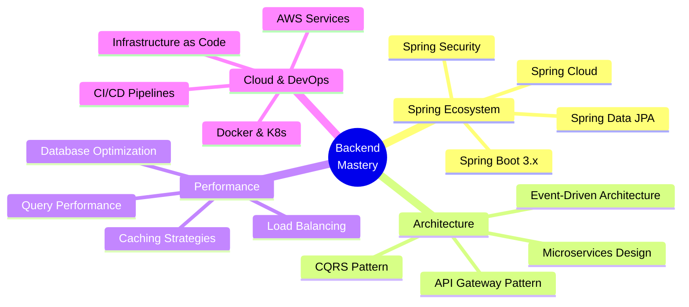

<div align="center">


</div>

<div align="center">
  
[](https://git.io/typing-svg)

</div>

<div align="center">

### 💼 Senior Backend Developer Aspirant | ☁️ Cloud Computing Enthusiast | 🎓 B.Tech CSE


</div>

<br>

<div align="center">
  
</div>

---

## 🎯 Professional Overview


```yaml
name: Arpan Chakraborty
role: Java Backend Developer
location: Kolkata, India
education: B.Tech in Computer Science & Engineering

current_focus:
  - Enterprise Java Applications
  - Spring Boot Microservices
  - RESTful API Architecture
  - Cloud-Native Development
  - Database Performance Optimization

expertise:
  primary: ["Java", "Spring Boot", "MySQL", "PostgreSQL"]
  frameworks: ["Spring Framework", "Hibernate", "Maven"]
  cloud: ["AWS", "Kafka"]
  tools: ["Git", "Postman", "IntelliJ IDEA"]

philosophy: |
  "Code is like humor. When you have to explain it, it's bad."
  - Cory House
```

<br clear="right"/>

**🚀 What Drives Me:**
- Building robust, scalable backend systems that handle millions of requests
- Architecting clean, maintainable code following SOLID principles
- Optimizing database queries for lightning-fast performance
- Contributing to open-source projects and helping fellow developers
- Exploring cutting-edge technologies in cloud computing and distributed systems

---

## 🤝 Connect With Me

<div align="center">

<a href="mailto:chakrabortyarpan225@gmail.com">
  
</a>
<a href="https://www.linkedin.com/in/arpan-chakraborty-63251227b/">
  
</a>
<a href="https://www.instagram.com/__a.r.p.a.n___/?hl=en">
  
</a>
<a href="https://www.facebook.com/profile.php?id=100027464049769">
  
</a>
<a href="https://www.youtube.com/@arpantabla4994">
  
</a>
<a href="https://arpanc.netlify.app">
  
</a>

</div>

---

## 🛠️ Tech Arsenal

<div align="center">

### Core Technologies

<table>
<tr>
    <td align="center" width="110" height="110">
        
        <br><strong>Java</strong>
    </td>
    <td align="center" width="110" height="110">
        
        <br><strong>Spring Boot</strong>
    </td>
    <td align="center" width="110" height="110">
        
        <br><strong>C</strong>
    </td>
    <td align="center" width="110" height="110">
        
        <br><strong>JavaScript</strong>
    </td>
    <td align="center" width="110" height="110">
        
        <br><strong>HTML5</strong>
    </td>
    <td align="center" width="110" height="110">
        
        <br><strong>CSS3</strong>
    </td>
</tr>
</table>

### Frameworks & Libraries

<table>
<tr>
    <td align="center" width="110" height="110">
        
        <br><strong>Spring</strong>
    </td>
    <td align="center" width="110" height="110">
        
        <br><strong>Hibernate</strong>
    </td>
    <td align="center" width="110" height="110">
        
        <br><strong>Maven</strong>
    </td>
</tr>
</table>

### Databases & Data Management

<table>
<tr>
    <td align="center" width="110" height="110">
        
        <br><strong>MySQL</strong>
    </td>
    <td align="center" width="110" height="110">
        
        <br><strong>PostgreSQL</strong>
    </td>
</tr>
</table>

### DevOps & Cloud

<table>
<tr>
    <td align="center" width="110" height="110">
        
        <br><strong>AWS</strong>
    </td>
    <td align="center" width="110" height="110">
        
        <br><strong>Kafka</strong>
    </td>
    <td align="center" width="110" height="110">
        
        <br><strong>Netlify</strong>
    </td>
    <td align="center" width="110" height="110">
        
        <br><strong>Vercel</strong>
    </td>
</tr>
</table>

### Development Tools

<table>
<tr>
    <td align="center" width="110" height="110">
        
        <br><strong>GitHub</strong>
    </td>
    <td align="center" width="110" height="110">
        
        <br><strong>Git</strong>
    </td>
    <td align="center" width="110" height="110">
        
        <br><strong>Postman</strong>
    </td>
    <td align="center" width="110" height="110">
        
        <br><strong>IntelliJ</strong>
    </td>
    <td align="center" width="110" height="110">
        
        <br><strong>VS Code</strong>
    </td>
</tr>
</table>

</div>

---

## 📊 GitHub Performance Metrics

<div align="center">


</div>

### 📈 Contribution Activity Graph

<div align="center">
  
</div>

---

## 🎯 Current Learning Path & Future Goals

<div align="center">



</div>

<br>

<table align="center">
<tr>
<td width="50%" valign="top">

### 🎯 Short-term Goals (2025)

- ✅ Master advanced Spring Boot concepts
- 🔄 Build production-ready microservices
- 🔄 Contribute to 5+ open-source projects
- 📝 Write technical blogs & tutorials
- 🎓 AWS Certification preparation
- 🤝 Mentor junior developers

</td>
<td width="50%" valign="top">

### 🚀 Long-term Vision (2025-2027)

- 🎯 Become a Senior Backend Engineer
- 🏗️ Architect large-scale distributed systems
- ☁️ Cloud Solutions Architect certification
- 📚 Build a comprehensive tech blog
- 🌟 Lead open-source projects
- 💼 Mentor aspiring developers globally

</td>
</tr>
</table>

---

## 🏆 Featured Projects & Contributions

<div align="center">

### 📌 Pinned Repositories

<a href="https://github.com/ArpanC6/ArpanC6">
  
</a>
<a href="https://github.com/ArpanC6/Calculator-Project">
  
</a>

</div>

---

## 💡 Technical Expertise & Interests

<div align="center">

<table>
<tr>
<td width="33%" valign="top">

### 🏗️ Backend Development
- RESTful API Design
- Microservices Architecture
- Spring Boot Applications
- Database Schema Design
- ORM & Data Modeling
- API Security & Authentication

</td>
<td width="33%" valign="top">

### ⚡ Performance & Scale
- Database Query Optimization
- Caching Strategies (Redis)
- Load Balancing
- Async Processing
- Connection Pooling
- Performance Monitoring

</td>
<td width="33%" valign="top">

### ☁️ Cloud & DevOps
- AWS Cloud Services
- Docker Containerization
- CI/CD Pipelines
- Apache Kafka
- Message Queues
- Infrastructure as Code

</td>
</tr>
</table>

</div>

---

## 🎓 Education & Certifications

<div align="center">

| 🎓 Degree | 🏛️ Institution | 📅 Duration | 📊 Status |
|:----------|:---------------|:------------|:----------|
| **B.Tech in Computer Science & Engineering** | Engineering College | 2021 - 2025 | 🎯 In Progress |

### 🏅 Achievements & Recognition

🏆 **GitHub Arctic Code Vault Contributor** - 2024  
⭐ **Active Open Source Contributor** - 2024  
💻 **23-Day GitHub Contribution Streak** - January 2025

</div>

---

## 💬 Areas of Collaboration

<div align="center">

### I'm passionate about collaborating on:


### Looking for help with:

🤝 **Mentorship** in Advanced System Design & Microservices Architecture  
🔍 **Code Reviews** and Best Practices in Enterprise Java  
💡 **Insights** on Cloud Architecture Patterns

</div>

---

## 🎨 Coding Philosophy & Approach

<div align="center">

> ### "First, solve the problem. Then, write the code."
> *— John Johnson*

<br>

<table>
<tr>
<td width="50%">

### 💭 My Approach

- **Write Clean Code**: Self-documenting and maintainable
- **Test-Driven**: Write tests before implementation
- **SOLID Principles**: Follow design patterns religiously
- **Performance First**: Optimize for speed and efficiency
- **Continuous Learning**: Stay updated with latest tech

</td>
<td width="50%">

### 🌟 What I Value

- **Code Quality** over quantity
- **Team Collaboration** and knowledge sharing
- **Problem-Solving** mindset
- **Constructive Feedback** culture
- **Work-Life Balance** for sustainable growth

</td>
</tr>
</table>

</div>

---

## 📚 Latest Blog Posts & Activities

<div align="center">

<!-- BLOG-POST-LIST:START -->
📝 **Coming Soon**: Technical blog posts on Spring Boot, System Design, and Backend Architecture  
🎥 **YouTube**: Coding tutorials and tech discussions at [@arpantabla4994](https://www.youtube.com/@arpantabla4994)  
💼 **Portfolio**: Check out my projects at [arpanc.netlify.app](https://arpanc.netlify.app)
<!-- BLOG-POST-LIST:END -->

</div>

---

## 🌐 Let's Build Something Amazing Together!

<div align="center">

### 📬 Get In Touch

Whether you want to discuss **backend architecture**, **collaborate on open-source projects**, or just have a **tech conversation**, I'm always open to connecting!

<br>

<a href="mailto:chakrabortyarpan225@gmail.com">
  
</a>

<a href="https://arpanc.netlify.app">
  
</a>

<br><br>

### ⚡ Fun Fact

**Debugging is like being the detective in a crime movie where you are also the murderer!** 🕵️‍♂️🐛

*When I'm not architecting backend systems, I'm exploring new frameworks, optimizing database queries, or helping fellow developers in the community!*

</div>

---

<div align="center">

### 📊 Profile Insights


<br>

### 💭 Random Dev Quote


</div>

---

<div align="center">

### 🙏 Thank You for Visiting!

**If you found my profile interesting:**

⭐ **Star** my repositories if you find them useful  
🤝 **Connect** with me for collaborations  
💬 **Reach out** for tech discussions  
📧 **Email** me for opportunities

<br>


**Crafted with 💙 and ☕ by Arpan Chakraborty**

<br>


</div>
