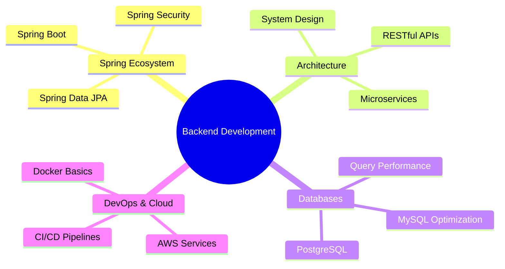

<div align="center">

# Welcome to My Digital Workspace


<p align="center">
  
  
  
</p>

</div>


## About Me - The Story Behind The Code

```javascript
const arpan = {
    location: "📍 Kolkata, India (UTC +5:30)",
    education: "🎓 B.Tech in Computer Science & Engineering",
    identity: "💼 Java Backend Developer | ☁️ Cloud Explorer",
    
    currentMission: () => {
        return [
            "🔨 Architecting robust backend systems with Spring Boot",
            "🌐 Exploring microservices and distributed systems",
            "📊 Deep diving into database optimization & design",
            "🤝 Contributing to open-source projects"
        ];
    },
    
    learningPath: {
        mastering: ["Spring Framework Ecosystem", "RESTful API Design", "System Design Patterns"],
        exploring: ["Apache Kafka", "Docker & Kubernetes", "AWS Cloud Services"],
        nextGoals: ["Microservices Architecture", "Event-Driven Systems", "DevOps Practices"]
    },
    
    codePhilosophy: "Clean code is not written by following rules. It's written with passion ✨",
    
    beyondCode: () => {
        return "When not coding, you'll find me debugging life's mysteries 🔍";
    },
    
    collaborate: {
        interestedIn: ["Backend APIs", "System Design Projects", "Open Source Contributions"],
        lookingFor: "Mentorship in Microservices & Cloud Architecture",
        reachOut: "Always open for tech discussions and collaborations!"
    }
};

console.log(arpan.currentMission());
```

<div align="center">

### 🤝 Let's Connect & Build Together

[](mailto:chakrabortyarpan225@gmail.com)
[](https://www.linkedin.com/in/arpan-chakraborty-63251227b/)
[](https://www.instagram.com/__a.r.p.a.n___/?hl=en)
[](https://www.facebook.com/profile.php?id=100027464049769)
[](https://www.youtube.com/@arpantabla4994)
[](https://arpanc.netlify.app)

</div>


## Technology Arsenal

<div align="center">

### Core Languages & Frameworks

<table>
<tr>
    <td align="center" width="96">
        
        <br>Java
    </td>
    <td align="center" width="96">
        
        <br>Spring Boot
    </td>
    <td align="center" width="96">
        
        <br>C
    </td>
    <td align="center" width="96">
        
        <br>JavaScript
    </td>
    <td align="center" width="96">
        
        <br>HTML5
    </td>
    <td align="center" width="96">
        
        <br>CSS3
    </td>
</tr>
</table>

### Database & ORM

<table>
<tr>
    <td align="center" width="96">
        
        <br>MySQL
    </td>
    <td align="center" width="96">
        
        <br>PostgreSQL
    </td>
    <td align="center" width="96">
        
        <br>Hibernate
    </td>
</tr>
</table>

### Tools & Technologies

<table>
<tr>
    <td align="center" width="96">
        
        <br>Git
    </td>
    <td align="center" width="96">
        
        <br>GitHub
    </td>
    <td align="center" width="96">
        
        <br>Maven
    </td>
    <td align="center" width="96">
        
        <br>Postman
    </td>
    <td align="center" width="96">
        
        <br>AWS
    </td>
    <td align="center" width="96">
        
        <br>Kafka
    </td>
</tr>
<tr>
    <td align="center" width="96">
        
        <br>Netlify
    </td>
    <td align="center" width="96">
        
        <br>Vercel
    </td>
    <td align="center" width="96">
        
        <br>IntelliJ
    </td>
    <td align="center" width="96">
        
        <br>VS Code
    </td>
</tr>
</table>

</div>


## GitHub Analytics

<div align="center">
  


</div>

<div align="center">
  
</div>

---

## 🏆 Achievement Showcase

<div align="center">
  
</div>


### Featured Projects

<div align="center">

<a href="https://github.com/ArpanC6/ArpanC6">
  
</a>

<a href="https://github.com/ArpanC6/Calculator-Project">
  
</a>

</div>


## Current Focus Areas

<div align="center">



</div>


## What Drives Me

<div align="center">

> **"The best way to predict the future is to invent it."**
> 
> I believe in continuous learning and building solutions that make a difference.

<table>
<tr>
<td width="50%">

### Professional Goals
- Master Spring Boot ecosystem
- Build production-ready microservices
- Contribute to major open-source projects
- Share knowledge through blogs & tutorials

</td>
<td width="50%">

### Learning Journey
- Advanced System Design patterns
- Cloud-native application development
- Performance optimization techniques
- Best practices in software architecture

</td>
</tr>
</table>

</div>


## Contribution Insights

<div align="center">


</div>


## 🎓 Certifications & Achievements

<div align="center">

| 🏅 Achievement | 📅 Year | 🔗 Verify |
|:---:|:---:|:---:|
| B.Tech CSE | 2021-2025 | 🎓 In Progress |
| GitHub Arctic Code Vault Contributor | 2024 | ✅ Verified |
| Open Source Contributor | 2024 | 🌟 Active |

</div>


## Let's Collaborate!

<div align="center">

### I'm always excited to work on:

🔹 **Backend Development Projects** | 🔹 **API Design & Development** | 🔹 **Open Source Initiatives**

🔹 **System Architecture** | 🔹 **Database Optimization** | 🔹 **Tech Community Building**

<br>

**📧 Reach me at:** [chakrabortyarpan225@gmail.com](mailto:chakrabortyarpan225@gmail.com)

**🌐 Visit my portfolio:** [arpanc.netlify.app](https://arpanc.netlify.app)

<br>

### Fun Fact About Me

*I debug with patience, code with passion, and believe that every bug is just an undocumented feature waiting to be discovered! 🐛✨*

</div>


<div align="center">

### A Quote I Live By


</div>


<div align="center">

## Thanks for stopping by!

**If you like what you see, feel free to:**

⭐ Star my repositories | 🤝 Connect with me | 💬 Reach out for collaborations


**Made with ❤️ by Arpan Chakraborty**

</div>
